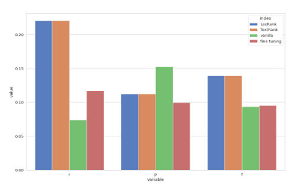
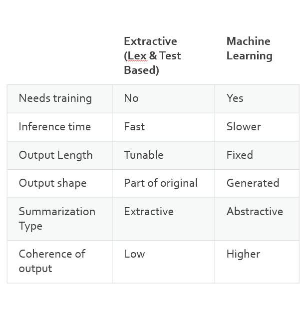
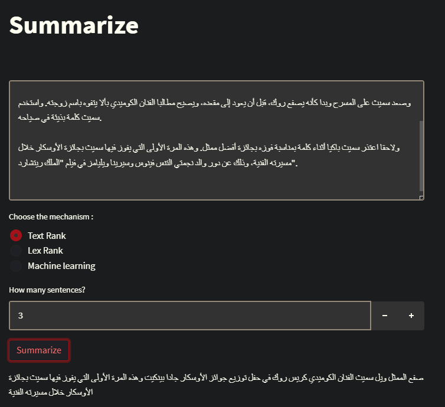
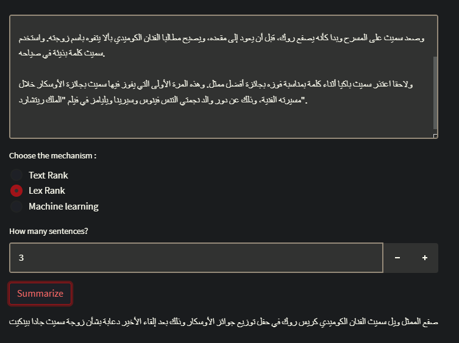
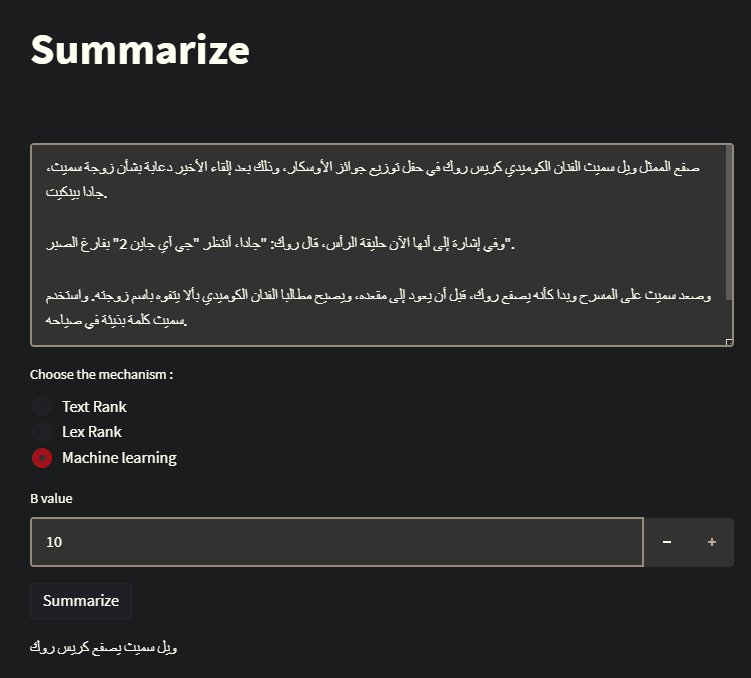

# Arabic-Text-Summarization
This project was part of ITI AI pro 1 Track as A graduation Project 
# Arabic-Text-Summarization
- This repo is dedicated to building an Arabic text summarization application a classic ML and modern DL approach. 

## Description
- it's trained on  XLSum dataset (37519 million article-summary from BBC)
- it's tuned with Data form Mawdoo3 300,000 records that cleaned to only 15,000 records

---
 
#### Preprocessing
- The preprocessing was done in a separate step and the data in hand is cleaned. 
- The preprocessing included letters normalization, removing tashkeel, substitute characters, removing symbols, punctuation, spaces,
- Tokenization has a pipeline that applies a normal tokenizing for text, removing stop words and removing repeated words. and has its own [NoteBook](https://github.com/Ibn-mohey/Arabic-Text-Summarization/blob/main/Notebooks/sentencepiece_tokenizer.ipynb)

 ---
 
#### Classic ML Modeling (Extractive Text Summarization)
- Extractive text summarization techniques perform summarization by picking portions of texts and constructing a summary, unlike abstractive techniques which conceptualize a summary and paraphrases it.

TextRank is an extractive and unsupervised text summarization technique.
●Then split the text into individual sentences.
●In the next step, we will tokenize each sentence to make a list of its words.
●Similarities between sentence lists of words are then calculated and stored in a similarities matrix.
●The similarity matrix is then converted into a graph, with sentences as vertices and similarity scores as edges, for sentence rank calculation.
●Finally, a certain number of top-ranked sentences form the final summary.

LexRank: The same approach of TextRank taken is lexrank and then we add what is called Eigenvector centrality, to find out the most important sentences LexRank utilizes eigenvector centrality. The method is called the power iteration method.
  
#### DL Modeling (Transformers)
Using pre-trained T5 — Text-To-Text Transfer Transformer and fine-tuned on another data set
- Trained using Kaggle GPU (NVIDIA V100).
---

#### Model Deployment 
- the model was deployed on Streamlit API to Be hosted locally any time after downloading the Model, and it's explained in the [file](https://github.com/Ibn-mohey/Arabic-Text-Summarization/blob/main/API/Runable_wep_app.ipynb)
  
---

## Evaluation Metrics and Results:
Optimizing the ROUGE score does not capture synonyms and related words that have the same meaning.
ROUGE does not cater for different words that have the same meaning — as it measures syntactical matches rather than semantics.

 

Compare The methods

--- 

## [API]((https://github.com/Ibn-mohey/Arabic-Text-Summarization/blob/main/API/Runable_wep_app.ipynb))

 

  

   

